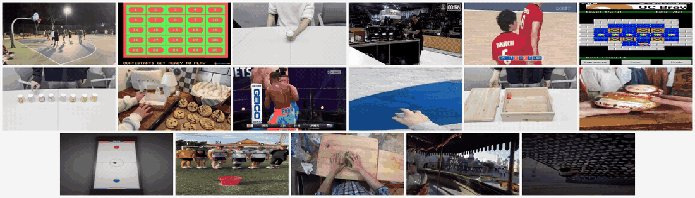
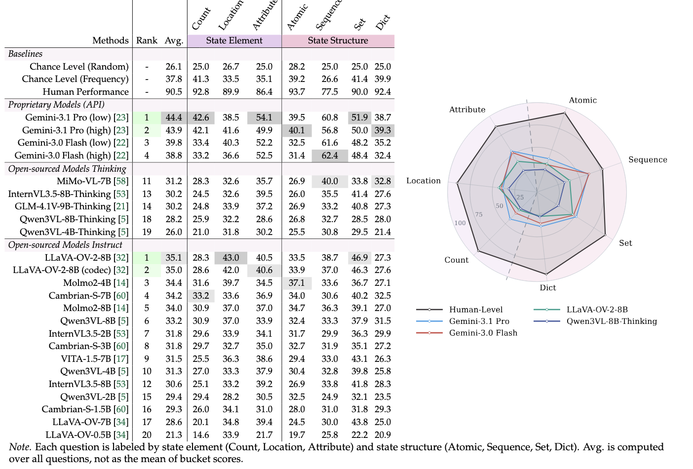

<h1 align="center">
  &nbsp;VSTAT: Benchmarking Visual State Tracking in Multimodal Video Understanding
</h1>

<p align="center">
  
</p>

<p align="center">
  <a href="https://arxiv.org/abs/XXXX.XXXXX"></a>
  <a href="https://vision-x-nyu.github.io/VSTAT"></a>
  <a href="https://huggingface.co/collections/nyu-visionx/vstat"></a>
  <a href="https://github.com/vision-x-nyu/VSTAT"></a>
  <a href="#license"></a>
</p>

<p align="center">
  <em>Can Multimodal LLMs track, reason about, and recall visual state changes over long videos?</em>
</p>

---

## Overview

**VSTAT** (Visual STAte Tracking) is a benchmark for evaluating the ability of Multimodal Large Language Models (MLLMs) to track fine-grained visual state changes in long-form videos. Unlike benchmarks that test static scene understanding or simple event recognition, VSTAT requires models to maintain a running mental model of object states, count changes, and temporal order across extended video sequences sourced from YouTube.

## Release

- `2026-05` 🚀 We release VSTAT benchmark, evaluation code, and reference launchers for open-weight models.

## Contents

- [Overview](#overview)
- [Release](#release)
- [Results](#results)
- [Installation](#installation)
- [Dataset](#dataset)
- [Evaluation](#evaluation)
- [Reference Launchers](#reference-launchers)
- [License](#license)
- [Acknowledgement](#acknowledgement)
- [Citation](#citation)

## Results

We benchmark video-supporting MLLMs from diverse model families in zero-shot settings with greedy decoding. Each question is labeled by **state element** (Count, Location, Attribute) and **state structure** (Atomic, Sequence, Set, Dict). MCQ tasks are scored by accuracy; numerical tasks by Mean Relative Accuracy (MRA). The reported average is computed over all questions.

<p align="center">
  
</p>

Even the strongest proprietary model (Gemini-3.1 Pro) reaches only **44.4** average, far below human performance (**90.5**), highlighting the difficulty of visual state tracking for current MLLMs. See our [project website](https://vision-x-nyu.github.io/VSTAT) for the full, interactive leaderboard.

## Installation

```bash
conda create --name vstat python=3.10
conda activate vstat

git clone https://github.com/vision-x-nyu/VSTAT.git
cd VSTAT

git submodule update --init --recursive
pip install -e ".[video]"
```

## Dataset

VSTAT is hosted on HuggingFace: [`VSTAT-NeurIPS2026/VSTAT`](https://huggingface.co/datasets/VSTAT-NeurIPS2026/VSTAT).

Download it into the local `data/` folder:

```bash
mkdir -p data
huggingface-cli download VSTAT-NeurIPS2026/VSTAT \
  --repo-type=dataset \
  --local-dir data/vstat
```

Then run the provided YouTube download and redaction scripts:

```bash
cd data/vstat
python scripts/download_youtube.py --resolution-map youtube_resolutions.json
bash scripts/redact.sh
cd ../..
```

Verify all referenced videos exist on disk:

```bash
python scripts/check_videos.py
```

This exits non-zero if any video is missing or empty — run it before evaluation to avoid silent multi-rank hangs.

**Custom paths:** If your data lives elsewhere, set:
```bash
export VSTAT_QA_PATH=/path/to/vstat_qa_clean.json
export VSTAT_VIDEO_ROOT=/path/to/vstat
```

## Evaluation

Task name: **`vstat`**

```bash
python -m lmms_eval \
  --include_path "$(pwd)/lmms_eval/tasks" \
  --model <model_name> \
  --model_args "<args>" \
  --tasks vstat \
  --batch_size 1 \
  --output_path ./results/vstat \
  --log_samples
```

## Reference Launchers

Pre-configured scripts for all evaluated models live under `scripts/vstat/`:

```
scripts/vstat/
├── api/
│   └── gemini.sh              # Gemini API evaluation
├── open_source_insturct/
│   ├── cambrians_*.sh         # Cambrian-S (1.5B, 3B, 7B)
│   ├── internvl3p5_*.sh       # InternVL3.5 (2B, 8B)
│   ├── llava_onevision_*.sh   # LLaVA-OneVision (0.5B, 7B)
│   ├── qwen3vl_*.sh           # Qwen3-VL (2B, 4B, 8B)
│   ├── frame_sweep_env.sh     # Shared env for frame sweeps
│   └── submit_all_vstat.sh    # Batch queue all models
└── opensource_thinking/
    ├── internvl3p5_8b_think.sh
    ├── mimo_vl_7b_think.sh
    └── qwen3vl_8b_think.sh
```

Each script uses environment variables for flexibility:

| Variable | Role | Default |
|----------|------|---------|
| `PYTHON` | Python interpreter | Active environment |
| `MAX_FRAMES` | Video frame budget | `32` |
| `LMMS_EVAL_TASKS_PATH` | Task include path | `$REPO_ROOT/lmms_eval/tasks` |
| `VSTAT_RESULTS_OPEN_SOURCE` | Output root | `$REPO_ROOT/results/vstat/open_source` |
| `HF_HOME` | HuggingFace cache | `~/.cache/huggingface` |

**Batch submission** (requires [task-spooler](https://vicerveza.homeunix.net/~viric/soft/ts/)):
```bash
bash scripts/vstat/open_source_insturct/submit_all_vstat.sh
```

## License

This project is licensed under the [Apache License 2.0](LICENSE).

## Acknowledgement

Our evaluation framework is built upon [lmms-eval](https://github.com/EvolvingLMMs-Lab/lmms-eval). We thank the LMMs-Lab team for providing this excellent toolkit for evaluating multimodal large language models.

## Citation

If you find our benchmark and code useful, please consider citing our work:

```bibtex
@article{vstat2026,
    title={{VSTAT: Visual State Tracking and Reasoning Benchmark}},
    author={},
    year={2026},
    journal={arXiv preprint arXiv:XXXX.XXXXX},
}
```
